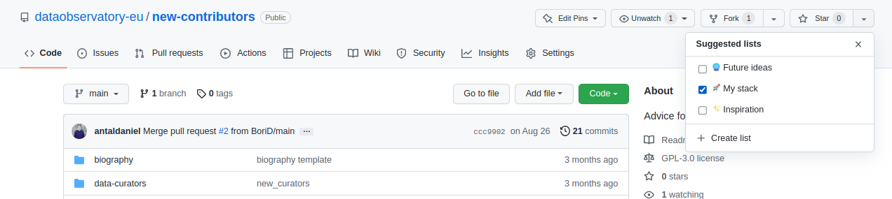
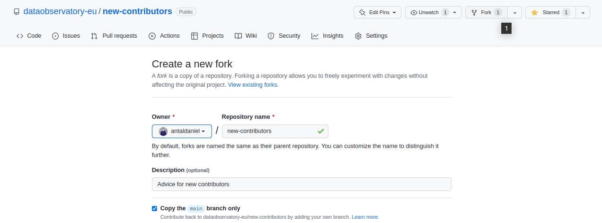
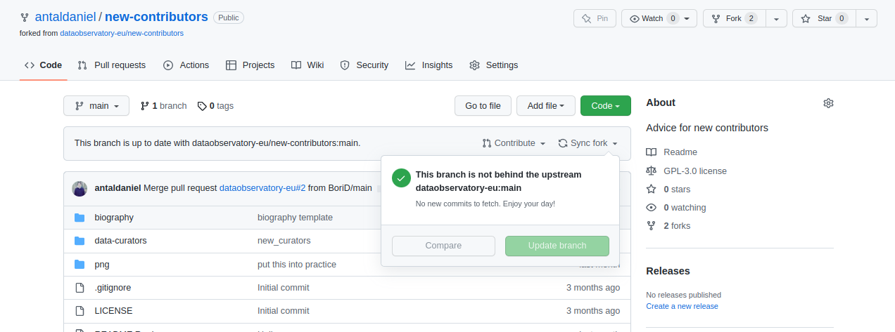

## Find the repository

1.  Go to the repository url on github. If the repository is public, you
    will see the page immediately. If it is private, you will see it as
    if it did not exist if you have no right to see it.

[github.com/dataobservatory-eu/new-contributors](https://github.com/dataobservatory-eu/new-contributors)

## Bookmark the repository

1.  Star this repo: dataobservatory-eu/new-contributors

<!-- -->

    knitr::include_graphics(here("png", "linux",  "github_star_repository.png"))

## Fork the repository

You create a branch, a version of the repository (folder), in your own
github.com space in the cloud by creating a fork. This is the first step
of the collaboration: you will always work with a copy of our files, and
you will only overwrite master files with the repository manager’s
explicit approval.

    knitr::include_graphics(here("png", "linux",  "github_create_fork.png"))

 You will have a copy of the entire
directory at `github.com/<your_username>/new-contributors`

## Download your copy

In the following screenshot, RStudio is used on an Ubuntu (Linux)
computer.

    knitr::include_graphics(here("png", "linux",  "github_create_fork.png"))

-   Downloading on a Windows version will be slightly different. Instead
    of using the SSH link, you will use the standard HTTPS link of the
    repository.
-   On Windows or Mac, you can use Github Desktop for synchronizing your
    folders. That is preferred to RStudio if you have large graphic
    files, PowerPoint presentations, or other large assets in the
    folder.

1.  `github.com/dataobservatory-eu/new-contributors` is in sync with
    your online copy, i.e. 
    `github.com/<your_username>/new-contributors`
2.  Your computer has a copy in sync with
    `github.com/<your_username>/new-contributors`.

## Upstream sync

What happens if you have not opened the
`<your_drive>/.../new-contributors` for some time? Maybe somebody
changed the contents of
`github.com/dataobservatory-eu/new-contributors`. If you want to stay in
sync, you have to make sure first that your online copy is updated from
the master repository.

    knitr::include_graphics(here("png", "linux",  "githu_sync_fork.png"))

1.  By pressing the Synch fork button, you can make sure that
    `github.com/dataobservatory-eu/new-contributors` is in sync with
    your online copy, i.e. 
    `github.com/<your_username>/new-contributors` again.
2.  You must pull any changes in the ‘upstream fork’ or the master
    folder down to your computer to make sure that
    `github.com/<your_username>/new-contributors` is again in sync with
    your local copy on `<your_drive>/.../new-contributors`

## Pull down new contents
