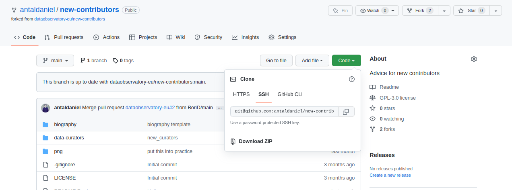
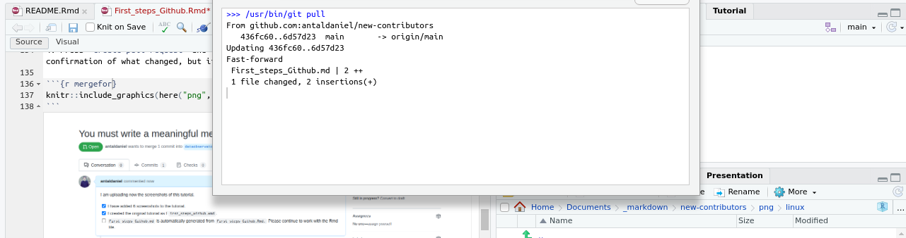
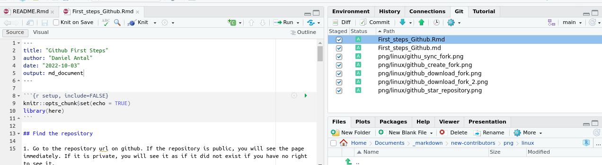
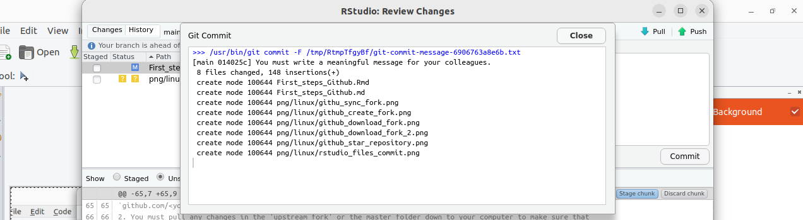
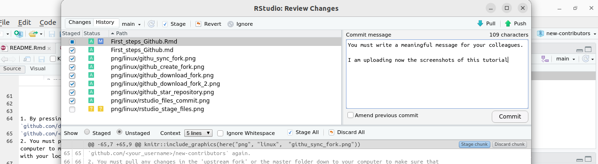
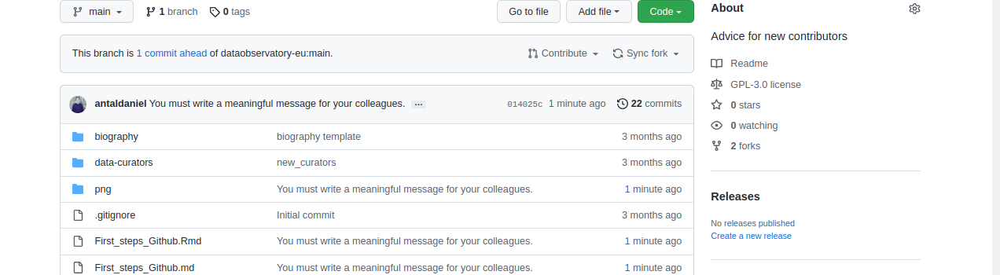
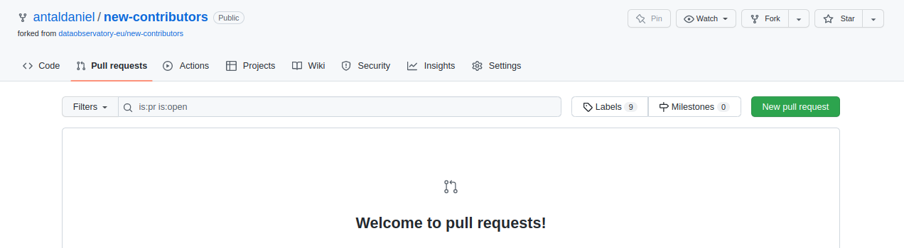
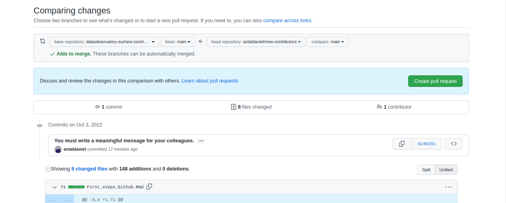
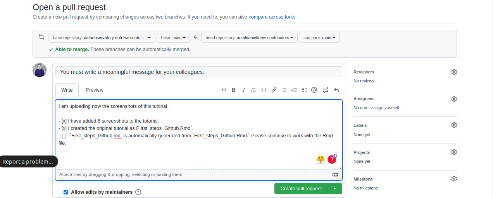
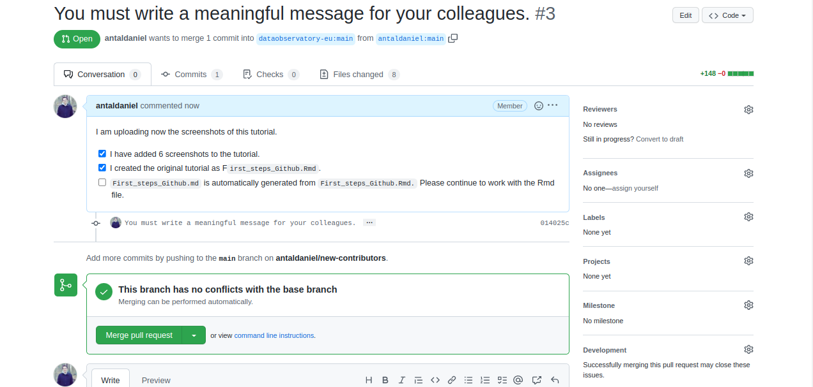

# First Steps on Github

In this tutorial, we will synchronize the contents of a team cloud-based
Github folder to your personal cloud space, then your computer, change
one text file, add a picture, and synchronize it back.

To make this happen, your computer needs to be securely authenticated to
the Github Enterprise Server. This authentication flow is likely to be
different on a Linux, Mac or Windows computer. Without authentication,
you can follow the first steps (downloading from a public folder or
repository) but you will not be able to modify a file or add/delete a
file.

## Authenticating your computer

To keep your account secure, you must authenticate before you can access
certain resources on GitHub Enterprise Server. This is the most
troublesome element of working with Github, and the most difficult,
becuase it is likely that you have not done anything like this before.
Luckily, you only have to do it once, and afterwards, you will have a
seamless syncronization experience.

You can use password login to the web interface, but you cannot sync
files to and from your computer with a password authentication alone.

### Github Desktop

If you use Windows or Mac, by default the best way to syncronize is via
downloading the Github Desktop application. Please follow
[authenticating with GitHub
Desktop](https://docs.github.com/en/enterprise-server@3.4/authentication/keeping-your-account-and-data-secure/about-authentication-to-github#authenticating-with-github-desktop)

### RStudio

If you want to learn to read or write R code, you should install and use
RStudio. This will be a great mardown editor, too. Please follow the
[Happy Git and GitHub for the useR](https://happygitwithr.com/) that
will give instructions for Windows, Mac, Linux.

-   [Personal Access
    Token](https://docs.github.com/en/enterprise-server@3.4/github/authenticating-to-github/creating-a-personal-access-token):
    RStudio oon Windows will likely use PAT and the HTTPS protocol.
-   [SSH](https://docs.github.com/en/enterprise-server@3.4/authentication/connecting-to-github-with-ssh/generating-a-new-ssh-key-and-adding-it-to-the-ssh-agent):
    RStudio on Linux will likely use this way.

## Find the repository

1.  Sign in to github.com with your password. You can pass this step
    without authenticating your personal computer.

2.  Go to the repository url on github. If the repository is public, you
    will see the page immediately. If it is private, you will see it as
    if it did not exist if you have no right to see it.

[github.com/dataobservatory-eu/new-contributors](https://github.com/dataobservatory-eu/new-contributors)

## Bookmark the repository

1.  Star this repo: dataobservatory-eu/new-contributors

You can pass this step without authenticating your personal computer.

## Fork the repository

You create a branch, a version of the repository (folder), in your own
github.com space in the cloud by creating a fork. This is the first step
of the collaboration: you will always work with a copy of our files, and
you will only overwrite master files with the repository manager’s
explicit approval. You can pass this step without authenticating your
personal computer.

You will see, among other things, the following information:

*A* fork *is a copy of a repository. Forking a repository allows you to
freely experiment with changes without affecting the original project.*

 You will have a copy of the entire
directory at `github.com/<your_username>/new-contributors`

## Download your copy

In the following screenshot, RStudio is used on an Ubuntu (Linux)
computer.

-   Downloading on a Windows version will be slightly different. Instead
    of using the SSH link, you will use the standard HTTPS link of the
    repository.
-   On Windows or Mac, you can use Github Desktop for synchronizing your
    folders. That is preferred to RStudio if you have large graphic
    files, PowerPoint presentations, or other large assets in the
    folder.
-   As you can see on the screenshot, you can download a folder
    (repository) in a single .zip file. This is good if you want to
    study the contents of a folder, but you will not be able to track
    changes and syncronize a folder copy that was downloaded as a zip
    file.

1.  `github.com/dataobservatory-eu/new-contributors` is in sync with
    your online copy, i.e. 
    `github.com/<your_username>/new-contributors`
2.  Your computer has a copy in sync with
    `github.com/<your_username>/new-contributors`.

## Upstream sync

You cannot log into your github.com account with a password. You need to
[create a personal access
token](https://docs.github.com/en/enterprise-server@3.4/authentication/keeping-your-account-and-data-secure/creating-a-personal-access-token)

What happens if you have not opened the
`<your_drive>/.../new-contributors` for some time? Maybe somebody
changed the contents of
`github.com/dataobservatory-eu/new-contributors`. If you want to stay in
sync, you have to make sure first that your online copy is updated from
the master repository.

1.  By pressing the Synch fork button, you can make sure that
    `github.com/dataobservatory-eu/new-contributors` is in sync with
    your online copy, i.e. 
    `github.com/<your_username>/new-contributors` again.
2.  You must pull any changes in the ‘upstream fork’ or the master
    folder down to your computer to make sure that
    `github.com/<your_username>/new-contributors` is again in sync with
    your local copy on `<your_drive>/.../new-contributors`

## Pull down new contents

If your `github.com/<your_username>/new-contributors` cloud space is in
sync with `github.com/dataobservatory-eu/new-contributors` again, you
can download the new files to your computer with pressing the blue arrow
down on RStudio, or pressing “Pull” on Github Desktop.

1.  Press `pull` and pull over the new files to your local computer.

## Synchronize changes

In this case, I use RStudio on an Ubuntu computer to send the files. The
steps are the same on Windows or Mac, and they are essentially the same
if you use GitHub Desktop for synchronizing a folder. The user interface
will look different.

1.  You select the files that you want to upload, or push up.

1.  You commit to sending the files up into the cloud. If the repository
    on github.com is public, you will make the files public, so think
    this step through.

1.  You must write a meaningful commit message. Why? If you had a
    previous task description (‘issue’), link or reference to it. Later
    you can undo these changes, and the better you describe them, the
    easier you will find this step and correct it, should you need it.
    Even more important: whoever will synchronize your changes to the
    team’s master repo will know what happened.

I wrote this:

`You must write a meaningful message for your colleagues.`
`I am uploading now the screenshots of this tutorial`

1.  Push the green arrow up, and the files will be uploaded to
    `github.com/<your_username>/new-contributors`.

## Did the new files arrive?

Go to `github.com/<your_username>/new-contributors` and check if the new
files are there. In this case, I changed the `Rmd` and `md` version of
this tutorial, and added the screenshots as `png` files to the `/png`
folder in the repository.

 As you can see, in the
cloud, on `github.com/antaldaniel/new-contributors` I can see that the
new files are there with my short commit message.

I also see a message that
`This branch is 1 commit ahead of dataobservatory-eu:main`. One bunch of
changes were committed to change the dataobservatory-eu team’s master
repository. How will I make sure that the original, public, joint
folder,
i.e. [github.com/dataobservatory-eu/new-contributors](https://github.com/dataobservatory-eu/new-contributors)
will be updated?

## Sync with your team

1.  On `github.com/<your-username>/new-contributors` you go to ‘pull
    requests’. Remember that earlier you pulled files down to your
    computer? Now we will pull files uploaded from your computer over
    the the team’s master repository.

2.  You do not control the team’s master repository, therefore you
    cannot pull the files over. You can request the project manager to
    pull it over after revision. This protects you from making mistakes
    in the team’s work.

1.  On `github.com/<your-username>/new-contributors` you go to ‘pull
    requests’

 3. You must give clearer
instructions on this pull request. One pull request may contain many
files, i.e. not only one commit, but many files from several commits in
one go. Therefore, it is a good practice to write a short summary of all
the changes you would like to do in the team’s master repository.

1.  Press `Create pull request` and **stop**. After the pull request is
    made, you will get a confirmation of what changed, but if you are
    offered, to not make the last step.

 5. **Do not press
`Merge pull request`** if you see it. Normally only your supervisor
should see it.

## Revision

1.  We create a copy of `dataobservatory-eu/new-contributors` to your
    cloud storage, i.e. `github.com/<your-username>/new-contributors`

2.  We downloaded the files in this repository or folder.

3.  We made changes in the files.

4.  You uploaded (*pushed*) the changes back to your cloud storage on
    `github.com/<your-username>/new-contributors`.

5.  You described your contribution, and asked the maintainer of
    `dataobservatory-eu/new-contributors` the to pull over after
    revision your new files from
    `github.com/<your-username>/new-contributors`.
